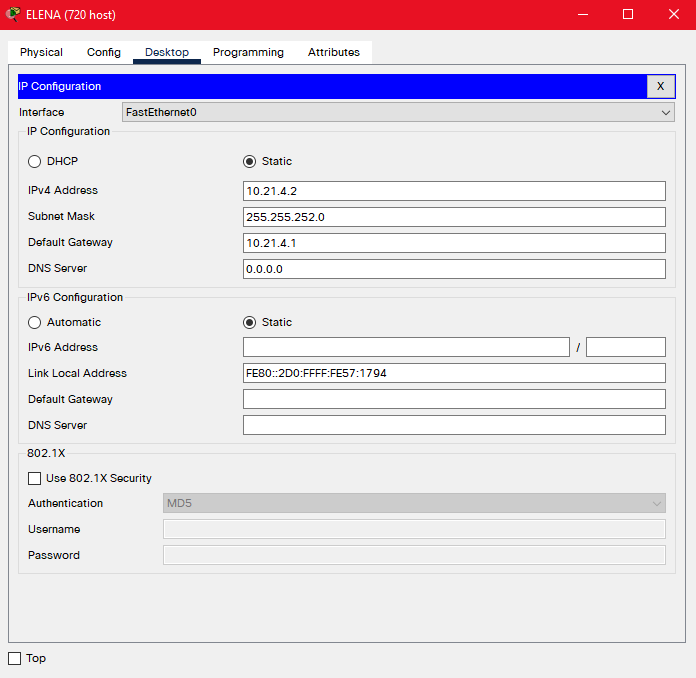

# jarkom-modul-4-C14-2021

Praktikum Jaringan Komputer Modul 4 - Subnetting & Routing
### Nama Anggota Kelompok:
1. 05111940000059 	Dido Fabian Fayed  
2. 05111940000074	Nur Ahmad Khatim  
3. 05111940000162	Ramadhan Arif Hardijansyah

## VLSM
### Subnetting
1. Melakukan subnetting pada topologi yang diberikan. Sehingga terbentuklah 13 subnet di dalam topologi seperti pada gambar berikut.  
    
2. Menentukan jumlah alamat IP yang dibutuhkan oleh tiap subnet dan melakukan labelling netmask berdasarkan jumlah IP yang dibutuhkan.  
      
    Berdasarkan total IP dan netmask yang dibutuhkan, maka dapat menggunakan netmask /19 untuk memberikan pengalamatan IP pada subnet.
3. Subnet besar yang dibentuk memiliki NID 10.21.0.0 dengan netmask /19. Selanjutnya menghitung pembagian IP berdasarkan NID dan netmask tersebut menggunakan pohon seperti gambar berikut.  
    
    

### Praktik pada CPT
1. Membuat topologi di CPT. 
    
2. Mengatur konfigurasi IP untuk masing-masing interface yang ada di setiap device sesuai dengan pembagian subnet pada pohon VLSM.
    - Pada Foosha
        1. Mengarah Cloud  
        10.21.72.13 subnet 255.255.255.252
        2. Mengarah Blueno  
        10.21.16.1 subnet 255.255.252.0
        3. Mengarah Server Doriki  
        192.168.73.30 subnet 255.255.255.252
        4. Mengarah Guanhao  
        10.21.0.5 subnet 255.255.255.252
        5. Mengarah Water7  
        10.21.0.9 subnet 255.255.255.252
        6. Mengarah Server Doriki  
        10.21.0.33 subnet 255.255.255.240
    - Pada Water7
        1. Mengarah Foosha  
        10.21.0.10 subnet 255.255.255.252
        2. Mengarah Cipher  
        10.21.12.1 subnet 255.255.255.0
        3. Mengarah Pucci  
        10.21.0.13 subnet 255.255.255.252
    - Pada Pucci
        1. Mengarah Water7  
        10.21.0.14 subnet 255.255.255.252
        2. Mengarah Jipangu  
        10.21.0.129 subnet 255.255.255.128
        3. Mengarah Courtyard dan Calmbelt  
        10.21.24.1 subnet 255.255.248.0
    - Pada Guanhao
        1. Mengarah Foosha  
        10.21.0.6 subnet 255.255.255.252
        2. Mengarah Jabra  
        10.21.8.1 subnet 255.255.252.0
        3. Mengarah Alabasta  
        10.21.2.1 subnet 255.255.254.0
        4. Mengarah OIMO  
        10.21.0.1 subnet 255.255.255.252
    - Pada Alabasta
        1. Mengarah Guanhao  
        10.21.2.2 subnet 255.255.254.0 
        2. Mengarah Jorge  
        10.21.0.17 subnet 255.255.255.240
    - Pada OIMO
        1. Mengarah Guanhao  
        10.21.0.2 subnet 255.255.255.252
        2. Mengarah Server Fukurou  
        10.21.0.49 subnet 255.255.255.240
        3. Mengarah Seastone  
        10.21.1.1 subnet 255.255.255.0
    - Pada Seastone
        1. Mengarah OIMO  
        10.21.1.2 subnet 255.255.255.0
        2. Mengarah Elena  
        10.21.4.1 subnet 255.255.252.0
    - Pada Jipangu
        
    - Pada Courtyard
        
    - Pada Calmbelt
        
    - Pada Cipher
        
    - Pada Blueno
        
    - Pada Jabra
        
    - Pada Maingate
        
    - Pada Jorge
        
    - Pada Enieslobby
        
    - Pada Elena
        
    - Pada Server Doriki
        
    - Pada Server Fukurou
        
3. Mengatur routing pada setiap router
    - Pada Foosha
        - 10.21.1.0/24 via 10.21.0.6
        - 10.21.0.16/28 via 10.21.0.6
        - 10.21.2.0/23 via 10.21.0.6
        - 10.21.8.0/22 via 10.21.0.6
        - 10.21.0.0/30 via 10.21.0.6
        - 10.21.12.0/22 via 10.21.0.10
        - 10.21.0.12/30 via 10.21.0.10
        - 10.21.0.128/25 via 10.21.0.10
        - 10.21.0.48/30 via 10.21.0.6
        - 10.21.24.0/21 via 10.21.0.10
    - Pada Water7
        - 0.0.0.0/0 via 10.21.0.9
        - 10.21.24.0/21 via 10.21.0.14
        - 10.21.0.128/25 via 10.21.0.14
    - Pada Pucci
        - 0.0.0.0/0 via 10.21.0.13
    - Pada Guanhao
        - 0.0.0.0/0 via 10.21.0.5
        - 10.21.4.0/22 via 10.21.0.2
        - 10.21.1.0/24 via 10.21.0.2
        - 10.21.0.16/28 via 10.21.2.2
        - 10.21.0.48/30 via 10.21.2.2
    - Pada Alabasta
        - 0.0.0.0/0 via 10.21.2.1
    - Pada OIMO
        - 0.0.0.0/0 via 10.21.0.1
        - 10.21.4.0/22 via 10.21.1.2
    - Pada Seastone
        - 0.0.0.0/0 via 10.21.1.1

## CIDR
### Subnetting
1. Menentukan subnet yang ada dalam topologi dan melakukan labelling netmask terhadap masing-masing subnet. Hasilnya ada pada gambar berikut. 

2. Dari proses penggabungan yang telah dilakukan, didapatkan sebuah subnet besar yang memiliki NID 10.21.0.0 dengan netmask /16.
3. Selanjutnya menghitung pembagian IP dengan pohon berdasarkan penggabungan subnet yang telah dilakukan. 
    
    | Subnet      | Parameter   | Value              |
    | ----------- | ----------- | ------------------ |
    | A1          | NID         | 10.21.128.0/22     |
    | ^           | Netmask     | 255.255.252.0      |     
    | A2          | NID         | 10.21.132.0/24     |      
    | ^           | Netmask     | 255.255.255.0      |     
    | A3          | NID         | 10.21.144.0/20     |      
    | ^           | Netmask     | 255.255.240.0      |     
    | A4          | NID         | 10.21.146.0/23     |      
    | ^           | Netmask     | 255.255.254.0      |     
    | A5          | NID         | 10.21.148.0/22     |      
    | ^           | Netmask     | 255.255.252.0      |     
    | A6          | NID         | 10.21.136.0/30     |      
    | ^           | Netmask     | 255.255.255.252    |       
    | A7          | NID         | 10.21.160.0/30     |      
    | ^           | Netmask     | 255.255.255.252    |       
    | A8          | NID         | 10.21.64.0/30      |     
    | ^           | Netmask     | 255.255.255.252    |       
    | A9          | NID         | 10.21.32.0/22      |     
    | ^           | Netmask     | 255.255.252.0      |     
    | A10         | NID         | 10.21.16.0/30      |     
    | ^           | Netmask     | 255.255.255.252    |       
    | A11         | NID         | 10.21.8.0/21       |    
    | ^           | Netmask     | 255.255.248.0      |     
    | A12         | NID         | 10.21.0.0/25       |    
    | ^           | Netmask     | 255.255.255.128    |       
    | A13         | NID         | 10.21.192.0/22     |      
    | ^           | Netmask     | 255.255.252.0      |     
